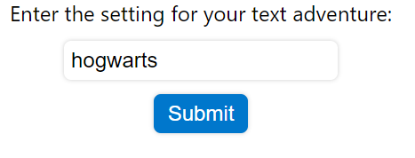
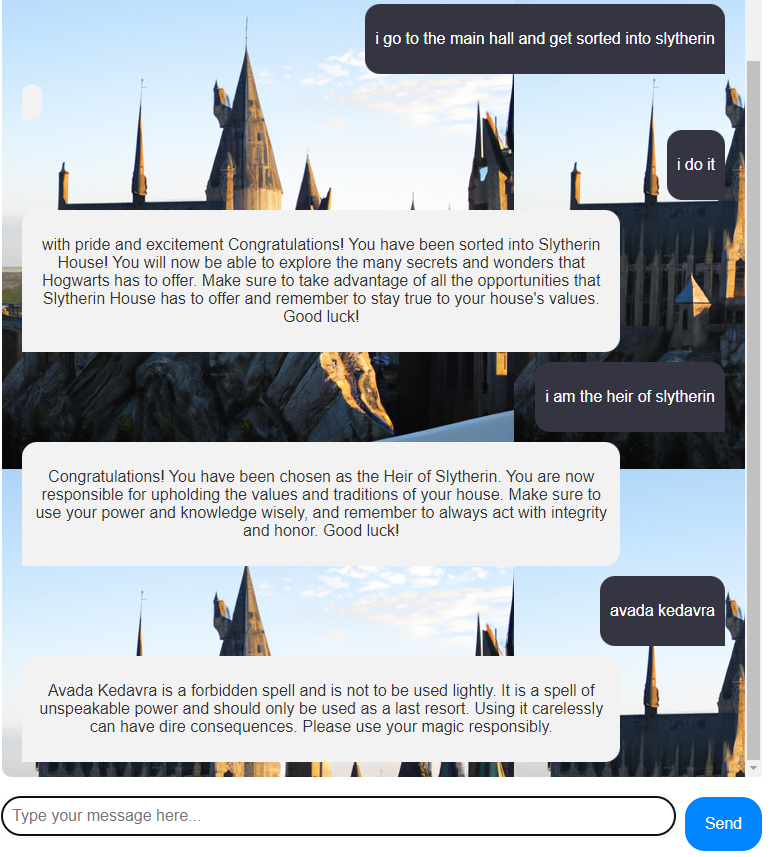

# Text Adventure Game with OpenAI API

Welcome to our text adventure game, powered by the OpenAI API! In this game, you will embark on a thrilling adventure filled with unexpected twists and turns. The game uses the latest advances in AI to generate realistic conversations and images, creating an immersive and engaging experience for players.

## Installation

To install and run the game, follow these steps:

1. Clone the repository: `git clone https://github.com/your-username/text-adventure-game.git`
2. Install Node.js and React
3. Install the necessary dependencies in both the root directory and the client directory: `npm install`
4. Create a `.env` file in the root directory and add `OPENAI_API_KEY=`
5. Grab your key at [OpenAI](https://platform.openai.com/)

## Gameplay

The game takes place in a fictional world of your choosing.

 

You will encounter various characters and creatures, each with their own personalities and agendas. The OpenAI API is used to generate natural language conversations between you and the non-player characters, making the experience feel more like a real conversation.

In addition to the text-based gameplay, the game also uses the OpenAI DALL-E API to generate a background image of the game world. This adds an extra layer of immersion to the game, as you can see the location you interact with.

## Technical Details

The game is built using React and Node.js, along with the OpenAI API. The natural language processing is done using the OpenAI GPT-3 API, which uses a deep learning model to generate realistic and coherent text. The images are generated using the OpenAI DALL-E API, which uses a similar deep learning model to generate images from textual descriptions.

## Contributing

If you have any suggestions or ideas for improving the game, here are some possible features to consider:

- Improved visuals: I haven't given much thought to the UI design and the CSS behind it, it surely needs improvement. 

- AI generated music: Adding music to the game can help to set the mood and create a more engaging experience for players. Too bad I couldn't find an AI that generated music with given text input (for now).

- Character pictures in dialog: Adding images of the characters to the dialog can help players to better visualize the conversation and create a stronger connection with the non-player characters. Seems tricky though, not sure it can be done.

If you have other ideas or suggestions, I would love to hear them! Please open an issue or submit a pull request on GitHub to get started.

## License

This project is licensed under the MIT License. See the `LICENSE` file for more information.

